# microservices

A multi-service demo that shows how **kindling** handles a real-ish
microservice architecture — three backend services, a React dashboard,
two databases, and a Redis message queue, all deployed to your local
Kind cluster with zero manual wiring.

## Architecture

```mermaid
flowchart LR
    user(("👩‍💻 Developer"))

    subgraph cluster["⎈  Kind Cluster"]
        ingress["🔶 Ingress\n<username>-ui.localhost"]
        gw["🌐 Gateway\n:8080"]

        subgraph orders-stack["Orders Stack"]
            orders["📋 Orders\n:8081"]
            pg[("🐘 Postgres")]
            rd[("⚡ Redis\nQueue")]
        end

        subgraph inventory-stack["Inventory Stack"]
            inv["📦 Inventory\n:8082"]
            mongo[("🍃 MongoDB")]
        end

        ingress --> gw
        gw -- "/orders" --> orders
        gw -- "/inventory" --> inv
        orders -- "reads/writes" --> pg
        orders -- "LPUSH\norder.created" --> rd
        rd -- "BRPOP\norder.created" --> inv
        inv -- "reads/writes" --> mongo
    end

    user -- "http://<user>-ui.localhost" --> ingress

    style cluster fill:#0f3460,stroke:#326CE5,color:#e0e0e0,stroke-width:2px
    style orders-stack fill:#1a1a2e,stroke:#f0883e,color:#e0e0e0
    style inventory-stack fill:#1a1a2e,stroke:#2ea043,color:#e0e0e0
    style ingress fill:#FF6B35,stroke:#FF6B35,color:#fff
    style gw fill:#326CE5,stroke:#326CE5,color:#fff
    style orders fill:#f0883e,stroke:#f0883e,color:#fff
    style inv fill:#2ea043,stroke:#2ea043,color:#fff
    style pg fill:#336791,stroke:#336791,color:#fff
    style rd fill:#DC382D,stroke:#DC382D,color:#fff
    style mongo fill:#00684A,stroke:#00684A,color:#fff
    style user fill:#6e40c9,stroke:#6e40c9,color:#fff
```



### Services

| Service | Port | Database | Description |
|---|---|---|---|
| **ui** | 80 | — | React dashboard. Place orders, view inventory, and watch the activity log in real time. |
| **gateway** | 8080 | — | Public HTTP entry point. Proxies `/orders` and `/inventory` to backend services. |
| **orders** | 8081 | Postgres 16 | Manages orders. Publishes `order.created` events to a Redis queue. |
| **inventory** | 8082 | MongoDB | Manages product stock. Consumes `order.created` events and decrements stock. |

### Data flow

1. `POST /orders` → Gateway forwards to Orders service
2. Orders service inserts a row into Postgres and `LPUSH`es an event onto the `order_events` Redis queue
3. Inventory service's background worker `BRPOP`s the event and decrements the product's stock in MongoDB
4. `GET /inventory` shows the updated stock levels

## What's inside

```
microservices/
├── .github/workflows/
│   └── dev-deploy.yml          # GH Actions: build all 4 images + deploy via sidecar
├── gateway/
│   ├── main.go                 # Reverse-proxy HTTP server
│   ├── Dockerfile              # Multi-stage build
│   └── go.mod
├── orders/
│   ├── main.go                 # Orders API + Redis queue publisher
│   ├── Dockerfile
│   └── go.mod
├── inventory/
│   ├── main.go                 # Inventory API + Redis queue consumer
│   ├── Dockerfile
│   └── go.mod
├── ui/
│   ├── src/                    # React + TypeScript dashboard
│   ├── Dockerfile              # Vite build → nginx serve
│   ├── nginx.conf.template     # Proxies /api/* → gateway
│   └── package.json
├── deploy/
│   ├── gateway.yaml            # DevStagingEnvironment CR
│   ├── orders.yaml             # DevStagingEnvironment CR (Postgres + Redis)
│   ├── inventory.yaml          # DevStagingEnvironment CR (MongoDB)
│   └── ui.yaml                 # DevStagingEnvironment CR (React UI)
└── README.md                   # ← you are here
```

## How image builds work

This demo uses **Kaniko** for container image builds — no Docker daemon needed.

The runner pod has a **build-agent sidecar** (see [root README](../../README.md#how-the-build-agent-sidecar-works)) that watches the shared `/builds` volume. The workflow:

1. **Tars** each service's build context → `/builds/<svc>.tar.gz`
2. **Writes** the image destination → `/builds/<svc>.dest` (e.g. `registry:5000/ms-orders:<tag>`)
3. **Touches** the trigger → `/builds/<svc>.request`
4. The sidecar launches a **Kaniko pod** that reads the tarball via stdin, builds the image, and pushes it to the in-cluster registry at `registry:5000`
5. The sidecar signals completion via `/builds/<svc>.done`

Deploy steps work similarly — the workflow writes YAML to `/builds/<name>.yaml` and touches `/builds/<name>.apply`. The sidecar runs `kubectl apply -f` and signals with `/builds/<name>.apply-done`.

> **Important:** The workflow starts with a cleanup step (`rm -f /builds/*`) to clear stale signal files from any previous run, since the `/builds` emptyDir persists for the life of the pod.

## Endpoints

### Gateway (`:8080`)

| Method | Path | Description |
|---|---|---|
| `GET` | `/` | Welcome message with route list |
| `GET` | `/healthz` | Liveness probe |
| `GET` | `/status` | Aggregated health of all services |
| `GET` | `/orders` | List recent orders (proxied) |
| `POST` | `/orders` | Create an order (proxied) |
| `GET` | `/inventory` | List product stock levels (proxied) |

### Orders (`:8081`)

| Method | Path | Description |
|---|---|---|
| `GET` | `/healthz` | Liveness probe |
| `GET` | `/status` | Postgres + Redis connectivity |
| `GET` | `/orders` | List orders (newest first, limit 50) |
| `POST` | `/orders` | Create order — `{"product":"widget-a","quantity":2}` |

### Inventory (`:8082`)

| Method | Path | Description |
|---|---|---|
| `GET` | `/healthz` | Liveness probe |
| `GET` | `/status` | MongoDB + Redis connectivity |
| `GET` | `/inventory` | List all products with stock levels |

---

## Quick-start

### Prerequisites

- Local Kind cluster created with `kind-config.yaml` (for registry mirror + Ingress ports)
- **kindling** operator deployed ([Getting Started](../../README.md#getting-started))
- `setup-ingress.sh` run (deploys registry + ingress-nginx)
- `GithubActionRunnerPool` CR applied with your GitHub username

### Option A — Push to GitHub (recommended)

Copy the microservices directory into a repo that your runner pool targets:

```bash
mkdir my-microservices && cd my-microservices && git init
cp -r /path/to/kindling/examples/microservices/* .
cp -r /path/to/kindling/examples/microservices/.github .

git remote add origin git@github.com:your-org/my-microservices.git
git add -A && git commit -m "initial commit" && git push -u origin main
```

Your local runner picks up the workflow, builds all four images via Kaniko,
pushes them to `registry:5000`, and applies the DevStagingEnvironment CRs.
The kindling operator provisions Postgres, MongoDB, and Redis automatically.

### Option B — Deploy manually (no GitHub push)

You can build and load images directly using Docker and Kind:

```bash
# Build and load images into Kind
for svc in gateway orders inventory ui; do
  docker build -t registry:5000/ms-${svc}:dev examples/microservices/${svc}/
  kind load docker-image registry:5000/ms-${svc}:dev --name dev
done

# Apply the DevStagingEnvironment CRs
kubectl apply -f deploy/orders.yaml
kubectl apply -f deploy/inventory.yaml
kubectl apply -f deploy/gateway.yaml
kubectl apply -f deploy/ui.yaml

# Wait for everything to come up
for svc in orders inventory gateway ui; do
  kubectl rollout status deployment/<your-username>-${svc} --timeout=120s
done
```

### Try it out

With ingress-nginx running, open the **React dashboard** — no port-forwarding needed:

```
🎨  http://<your-username>-ui.localhost        ← Dashboard
🌐  http://<your-username>-gateway.localhost   ← Gateway API (if ingress configured)
```

Or use curl against the gateway:

```bash
# Check everything is healthy
curl -H "Host: <your-username>-gateway.localhost" http://localhost/status | jq .

# Create an order
curl -X POST -H "Host: <your-username>-gateway.localhost" http://localhost/orders \
  -H "Content-Type: application/json" \
  -d '{"product":"widget-a","quantity":3}' | jq .

# Wait a moment for the queue consumer, then check inventory
sleep 2
curl -H "Host: <your-username>-gateway.localhost" http://localhost/inventory | jq .
```

<details>
<summary><strong>Without Ingress (port-forward fallback)</strong></summary>

```bash
kubectl port-forward svc/<your-username>-gateway 8080:8080
curl localhost:8080/status | jq .
```

</details>

Expected output — `widget-a` stock decremented from 100 → 97:

```json
[
  {"name": "gadget-x",  "stock": 50,  "updated_at": "..."},
  {"name": "widget-a",  "stock": 97,  "updated_at": "..."},
  {"name": "widget-b",  "stock": 250, "updated_at": "..."}
]
```

---

## How the Redis queue works

The orders service and inventory service share a single Redis instance
(provisioned by the orders service's `DevStagingEnvironment`). The
inventory service's CR overrides its `REDIS_URL` env var to point at the
orders service's Redis:

```yaml
# inventory DevStagingEnvironment
spec:
  deployment:
    env:
      - name: REDIS_URL
        value: "redis://<username>-orders-redis:6379/0"
```

The queue protocol is simple:

- **Producer** (orders): `LPUSH order_events <json>`
- **Consumer** (inventory): `BRPOP order_events 2` (blocking pop with 2s timeout)

Event payload:

```json
{
  "event": "order.created",
  "order_id": 1,
  "product": "widget-a",
  "quantity": 3,
  "time": "2026-02-14T12:00:00Z"
}
```

---

## Cleaning up

```bash
kubectl delete devstagingenvironments -l app.kubernetes.io/part-of=microservices-demo
```

The operator garbage-collects all owned Deployments, Services, and
dependency pods automatically.
